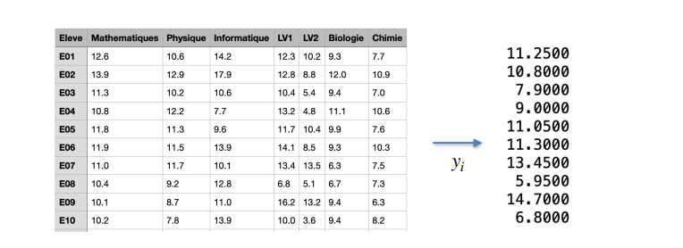
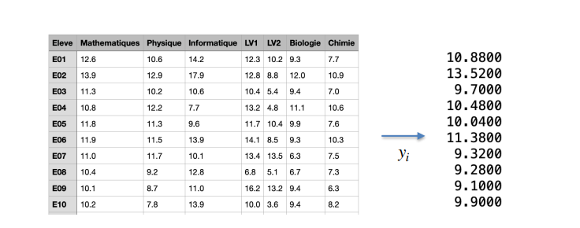

# Mathematics & Gradients everywhere: Opening the black box!

For sure, you heard about the power of Neural Networks to transform complex representation into insighful information.
Let's take a simple example in Computer Vision. Given an image, you may build a ANN in order to recognize if some objects are present in the image or not. 
In the following image we provided an image of a guy to a classic Neural Network architecture(which we'll be stydying later on these series) and it will output the probability that a given object is present in the given image.
If we want our ANN to recognize many objects simultaneously, it will output a vector containing the probabilities that these elements.


Technically, a well advised one would say something like this:

> Neural Network parameters learned using stochastic gradient descent with mini-batches sizes of 50.

But since we're beginners and eager to learn how this is done in depth we're going to treat the following points:
- How the Neural Network trnasforms layer by layer an image to probabilities?
- What is Gradient Descent?
- Backpropagation: How to compute gradients of a Neural Network parameters?
- Why Stochastic?


So if like me, you're excited by all these ANNs stuffs, lettttttttttt's gooooooooooo!!!!!

# I- Transforming data representation

## 1. Dense Layers

### Simple Dense Layer

Imagine you're an high school teacher and after end-of-year evaluations you stored the grades of your students in a table like the following one:


Each row is for students and each columns for a specific course taken.

About variables in this table:

|French         | English             |
| ------------- | ------------------- |
| Mathematiques | Mathematics         |
| Physique      | Physics             |
| Informatique  | Computer Science    |
| LV1           | Natural Language 1  |
| LV2           | Natural Language 2  |
| Biologie      | Biology             |
| Chimie        | Chemistry           |


Well, so basically the problematic is 
> How do you highlight features or let's say extract meaningful information from this table(data)?

- An intuive solution that schools often use is calculating the mean of all the grades for each student. In this case we'll got something like that:


- A more general solution to the previous one is calculating a weighted sum of the grades in order to extract specific features/tendences for each student.
The general formula is the following one:

    * So if for example we want to know who are the students that are very great at Natural Languages out of the 7 subjects, we can take this following vector 
    ...   - Mean in Languages


    * A second illustration is comes when we want to compare students that are great in Mathematics vs Physics. Taking a weight vector as this one ... simply computes the difference between the two grades: 


    * Now let's say we want to know how each student performs in scientific subjects. Like in the first example we can simply compute a weighted sum of the scientific subjects with a weight vector given as: ...


Well you noticed that it's interesting to see in a more informative way how our students performs generally, in Natural Languages and in Scientific subjects... That's great, but too easy. Yes indeed, we need some more and specific information.

> So how can we keep only the information that interests us?


### Dense layer with bias, followed by ReLU (Rectified Linear Unit)

If the previous question is not yet clear to you, imagine from the third(last) illustration we only want to know exactly who are the students that are above the average to pass (10 in our case) in scientific subjects and discard the remaining ones.
A simple solution consists to substract 10 to the weighted sum result and then keep only students whose results zre positive(above zero).

Here is an illustration:


The formula is something like that : 


In Deep Learning, b (value 10 here) is called **the bias term** and the function max(0, s)... is the **Rectified Linear Unit called ReLU** for short.
**Simply put, ReLU allows you to set unnecessary information to zero** (of course depending on the weightings chosen).

Let's apply same principles to Languages subjects and see which students performs well on both scientific and Languages:


Isn't it cool? Since I'm a programmer, I'll find it more cool if I can program it :)

> How do we code this in a language dedicated to neural networks?

```python

```


## 2. Convolution filters


# II- Gradient Descent


# III- Parameters learning of a Neural Network

