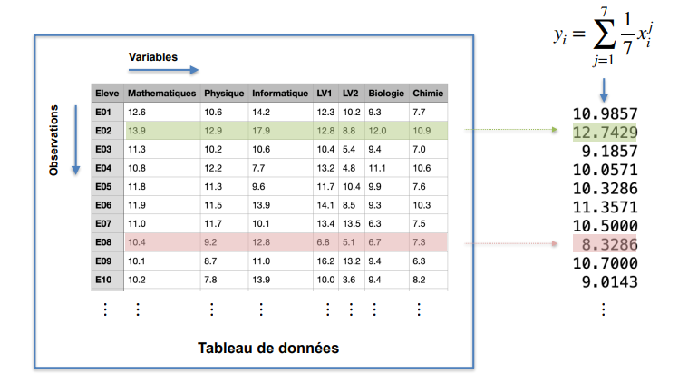
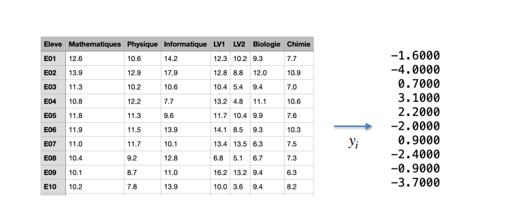
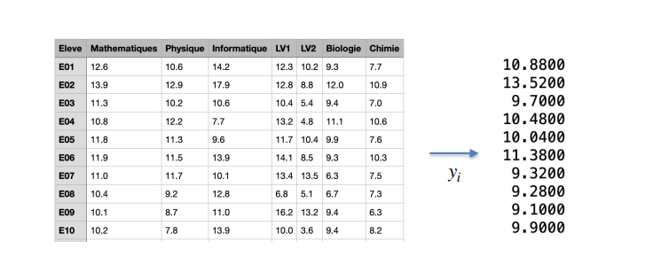
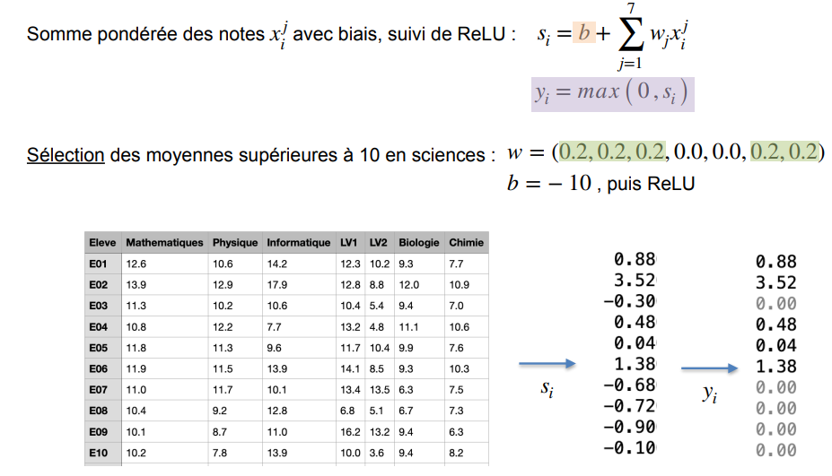
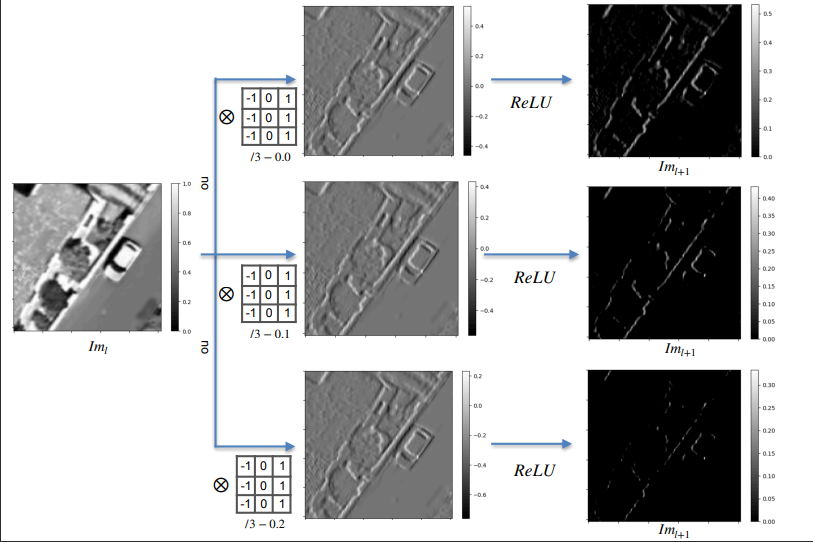
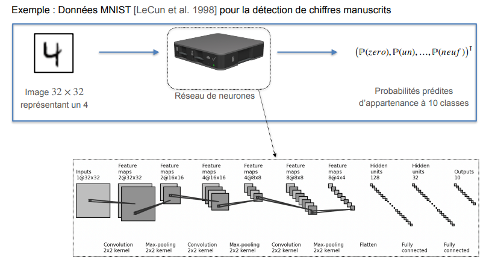
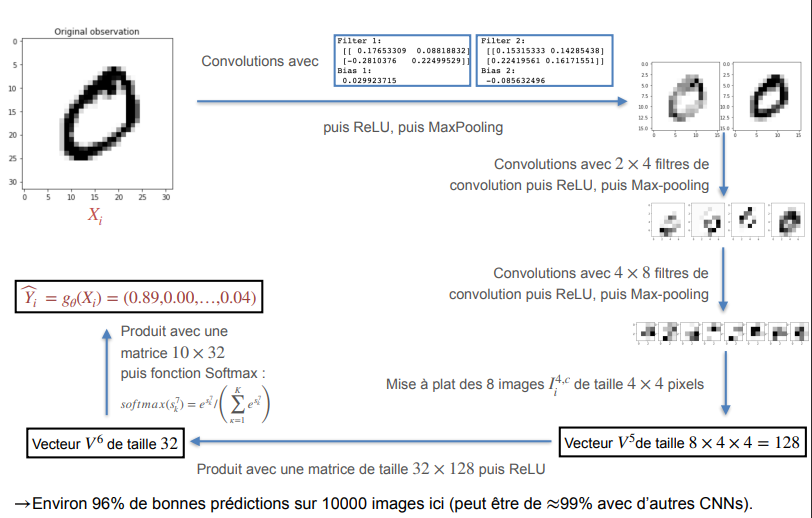

# Mathematics & Gradients everywhere: Opening the black box!

For sure, you heard about the power of Neural Networks to transform complex representation into insighful information.
Let's take a simple example in Computer Vision. Given an image, you may build a ANN in order to recognize if some objects are present in the image or not. 
In the following illustration we provided an image of a guy to a classic Neural Network architecture(which we'll be stydying later on these series) and it will output the probability that a given object is present in the given image.
If we want our ANN to recognize many objects simultaneously, it will output a vector containing the probabilities of these elements present or not.


Technically, a well advised one would say something like this:

> **Neural Network parameters learned using stochastic gradient descent with mini-batches of size 50.**

But since we're beginners and eager to learn how this is done in depth we're going to treat the following points:
- How does the Neural Network transform layer after layer, an image into probabilities? 
- What is Gradient Descent? 
- Backpropagation: How to compute gradients of a Neural Network parameters?
- Stochastic... what is it and what's the point?


So if like me, you're excited by all these ANNs stuffs, lettttttttttt's gooooooooooo!!!!!

# I- Transforming data representation

## 1. Dense Layers

### Simple Dense Layer

Imagine you're an high school teacher and after end-of-year evaluations you stored the grades of your students in a table like the following one:


Each row is for students and each columns for a specific course taken.

About variables in this table:

|French         | English             |
| ------------- | ------------------- |
| Mathematiques | Mathematics         |
| Physique      | Physics             |
| Informatique  | Computer Science    |
| LV1           | Modern Language 1  |
| LV2           | Modern Language 2  |
| Biologie      | Biology             |
| Chimie        | Chemistry           |


Well, so basically the problematic is 
> **Question 1: How do you highlight features or let's say extract meaningful information from this table(data)?**

- An intuive solution that schools and teachers often use is **calculating the mean of all the grades** for each student. In other words, we sum up all the grades for each student and then divide by the total number of subjects (7 here). This operation simplifies the information since we have now at hand only one column showing ...
In this case we'll got something like that:


- A more general solution to the previous one is **calculating a weighted sum of the grades** in order to extract specific features/tendences for each student.  
The **general formula** is the following one, where the w_j represent the weights and the x_i_j the j_th grade of the i_th student :    
<center></center> 


    - For example, if we want to know which students are very **strong only in Modern Languages**, we can take the weight vector as follows: `w = (0.0, 0.0, 0.0, 0.5, 0.5, 0.0, 0.0)`.  
It simply **calculates the average of the marks obtained in the two language subjects**!  


    - A second illustration comes when we want to **compare students who are excellent in mathematics and those who are excellent in physics*. Taking a weight vector `w = (1.0, 0.0, − 1.0, 0.0, 0.0, 0.0, 0.0)`, we simply calculate **the difference between the two scores**: 


    - Now let's say we want to know how each student performs in **scientific subjects**. Like in the first example we can simply compute **a weighted sum of the scientific subjects** with a weight vector given as `w = (0.2, 0.2, 0.2, 0.0, 0.0, 0.2, 0.2)`.
**The average performance in scientific subjects.**  


Well you noticed that it's interesting to see in a more informative way how our students performs generally in all the subjects, and particularly in Modern Languages and in Scientific subjects... That's great, but too easy. Yes indeed, we need some more and specific information.


> **Question 2: How can we keep only the information that interests us?**


### Dense layer with bias, followed by ReLU (Rectified Linear Unit)

If the previous question is not yet clear to you, imagine from the third(last) illustration we only want to know exactly who are the students that are above the average to pass (10 in our case) in science subjects and discard the remaining ones (others that are below the passing average).  
A simple solution would be to subtract 10 from the weighted sum and keep only those students whose results are positive (above zero).

Here is an illustration:


So basically, what is done here is substracting 10 to the result of the weighted sum of scientific subjects and using the ReLU function we test if the global result is greater than zero (0) then we keep it as it is but if it's negative we replace it by zero (0).  

In Deep Learning, b (value 10 here) is called **the bias term** and the function **y_i = max(0, s_i)** is the **Rectified Linear Unit called ReLU** for short.  
**Simply put, ReLU allows you to set unnecessary information to zero** (of course depending on the weightings chosen).

Let's apply same principles to Languages subjects and see which students performs well on both scientific and Languages:

  
You noticed we passed **from a 7 columns raw table to a 2 columns meaningful table** showing us exactly what we wanted to know i.e., the best students in Sciences and Languages. We can even go futher by repeating this process again and again with different weights and different subjects.
I think at this stage, you got the point: **this process is exactly what Dense layers in Neural Networks do.**

So to sum up, what Dense layers i.e., **several weighted sums with bias, followed by ReLU** do is:
- **Data dimension reduction** 
- **Feature extraction**
- **Information selection**


Isn't it cool? But since I'm a programmer, I'll find it more cool if I can program it :)

> **Question 3: How do we code this in a language dedicated to Neural Networks?**


### Practice with code

First let's start by importing the necessary librairies. 
Note that we're going to use PyTorch for all the Neural Networks implementations in these series.

```python
import numpy as np                # linear algebra
import pandas as pd               # data processing
import matplotlib.pyplot as plt   # visualisations

import torch                      # PyTorch
```

Now let's import the data itself using Pandas. Note that I'm working in a Kaggle environment:

```python
data = pd.read_csv("/kaggle/input/notes-table/table notes.png.csv")
```
The DataFrame looks like this:


```python
data.pop("Eleve")
subjects = list(data.keys())

notes = data.to_numpy()
print(notes)
```

```python
notes_pt = torch.tensor(notes, dtype=torch.float64)

# define activation function
activation_fct_relu = torch.nn.ReLU()

# define dense layer and it parameters(7 input features; 2 output features)
linear_filter = torch.nn.Linear(7, 2, bias=True)
```

```python
linear_filter.weight.data = torch.tensor([[0.2, 0.2, 0.2, 0.0, 0.0, 0.2, 0.2],
                                         [0.0, 0.0, 0.0, 0.5, 0.5, 0.0, 0.0]], 
                                        dtype=torch.float64)
linear_filter.bias.data   = torch.tensor([-10, -10], dtype=torch.float64)
```

```python
filtered_data = activation_fct_relu(linear_filter(notes_pt[:,:]))
print(filtered_data)
```


## 2. Convolution filters

Another fundamental building blocks in Neural Networks that allows to recognize patterns within data (typically images but not only) are **Convolutional layers**.


### Convolution 

Convolution is simply a mathematical operation used to process images or other multidimensional data. It involves **sliding a small matrix also called "kernel" or "filter" over the image**. This kernel is typically a square matrix with numbers. 
At each position, the kernel multiplies element-wise with the overlapping part of the image, and then adds up all the results to produce a single number. This process is repeated across the entire image and as the filter moves, it detects features such as edges, textures, or shapes at different positions.
Here is a simple illustration:
  

The mathematical formula is the follwing one
  

The PyTorch code to apply this operation to a given image with the same kernel as above can be:

```python


```

I'm sure you're asking yourself, what if we use a different kernel on the same image? 
Well, by applying multiple filters to an image, Convolutional layers can learn to detect various features at different scales and orientations.

For example, a kernel might detect vertical edges by responding strongly to transitions from dark to light or light to dark in a vertical direction. 
After convolution, the resulting image will typically have highlighted features that the kernel was designed to detect.

  


### Convolution and bias, followed by ReLU

  


```python


```

  


### Assembling building blocks: Neural network architecture

  


```python


```

Once the Neural Network parameters "learned", we can test it:
```python


```

> **How does the Neural Network modify the image layer by layer?**
Well an image is worth thousand words:

  

Here are the steps summurized:
- 

Using this architecture we got around 96% correct predictions on 10000 images here (may be ≈99% with other CNNs). 

### Summury

  

CNN learning: Optimization of [convolution filters], [bias] and [last layer matrices 
layers] so that they lead to the best possible predictions on a training set. 
- Filters highlight relevant properties in the image 
- Mixing different channels can create advanced representations of information 
- Using biases, ReLU functions can remove unnecessary information 
- Max-pooling selects the most relevant information from each image region


# II- Gradient Descent

Problematic: Let's say, we know the students' grades in the 2022-2023 school year, as well as their marks in an end-of-year competition. 
We would like to predict the grades of the students in the class of 2023-2024 based on their grades during the year

  

- Let's use a very simple model: linear regression with parameters O = {w_0, w_1,..., w_p}!


# III- Parameters learning of a Neural Network

